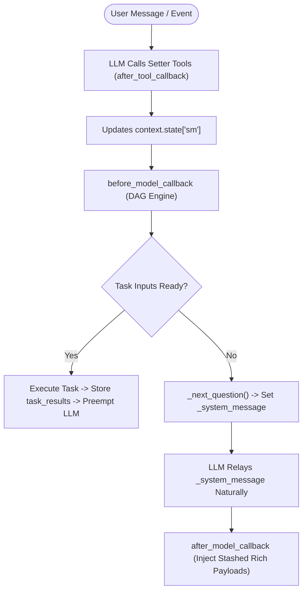

# CXAS Deterministic Slot-Filling Agent Implementation Guide

**Author:** Delivery & Agent Engineering Team  
**Target Platform:** CX Agent Studio (CXAS) | SCRAPI | Jetski / Antigravity Accelerator  
**Version:** 2.0 (Official SCRAPI DAG Framework Architecture + Real-World Best Practices)  

---

## 1. Architectural Overview & Design Philosophy

The **Slot Filling Pattern** (also known as the **Slot Filling DAG Framework**) is the deterministic, no-LLM-fallback architecture for CX Agent Studio (CXAS). 

### The Problem
CXAS has no native slot-filling primitive. Relying on an LLM's prompt memory (`<taskflow>`) to manage multi-turn state collection leads to 4 critical failure modes:
1. **State Fragility:** The LLM "forgets" slot values in multi-turn conversations.
2. **Premature Task Firing:** The LLM triggers backend APIs before all required inputs are gathered.
3. **Progressive Disclosure Failure:** The LLM previews future questions instead of asking one step at a time.
4. **Validation Bypass:** The LLM accepts invalid inputs without calling validation tools.

### The Solution
Split responsibilities clearly between Python and the LLM:
* **Python (The Callback Engine):** Owns state (`sm`), control flow, DAG evaluation, validation, task firing, and preemption.
* **The LLM:** Owns natural language: parsing user intent, calling setter tools, and relaying `_system_message` naturally.



---

## 2. The `sm` State Variable

All slot-filling state is maintained in a single session-scoped dictionary named `sm`, declared as a `STRING` variable in your app's `variableDeclarations`.

```json
{
  "filled": {},
  "pending": {},
  "deferred": {},
  "task_results": {},
  "_retries": {},
  "_slot_errors": [],
  "_system_message": "",
  "_steer_back_turns": 0,
  "status": "in_progress"
}
```

| Key | Purpose |
| :--- | :--- |
| `filled` | Confirmed slot values: `{"slot_a": "VAL_A", "slot_b": "VAL_B"}` |
| `pending` | Values awaiting user confirmation/readback before moving to `filled` |
| `deferred` | Values held for grouped readback before task-level confirmation |
| `task_results` | Output payloads from executed tasks: `{"FetchOptionsTask": {...}}` |
| `_retries` | Failure counters for tasks and slot validation retries |
| `_slot_errors` | Validation errors returned from setter tools |
| `_system_message` | Next question for the LLM to relay — written by Python, read via `{{system_message}}` |
| `_steer_back_turns` | Off-topic turn counter driving steer-back recovery |
| `status` | Lifecycle status: `"in_progress"`, `"complete"`, `"escalated"` |

---

## 3. The 4 Control Surfaces

### Surface 1: Agent System Instruction (`<slot_filling_protocol>`)

The instruction defines the LLM's role: batch call ALL setter tools for user inputs, follow progressive disclosure, and relay `_system_message`.

```xml
<slot_filling_protocol>
You are operating in SLOT FILLING mode. Follow these rules strictly:

1. TOOL-DRIVEN CONVERSATION: Identify EVERY piece of information provided 
   and call ALL corresponding setter tools in the SAME turn. 
   Example: If the user provides "Option A and Option B under Name J", call 
   set_option_a, set_option_b, AND set_name — all in one turn.

2. PROGRESSIVE DISCLOSURE: Ask only ONE question at a time. Never preview 
   future steps.

3. RELAY SYSTEM MESSAGES: When _system_message is set in the directive, 
   incorporate it naturally into your response. Include exact values/options.

4. ALWAYS CALL TOOLS: Call the setter tool for every piece of information, 
   even if out of range. Python validates all inputs.
</slot_filling_protocol>

<system_directive>
{{system_message}}
</system_directive>
```

### Surface 2: Setter Tool Docstrings (Keep Short!)

Docstrings MUST be concise (1–2 sentences: format + trigger phrase only). 

> [!WARNING]
> **Verbose docstrings break multi-slot batching.** Putting business logic or validation rules inside docstrings confuses the LLM and causes it to evaluate tools individually instead of batching multiple setter calls in one turn.

```python
# GOOD: Format + Trigger phrase only
def set_slot_date(date_val: str) -> dict:
    """Record date in YYYY-MM-DD format.
    
    Convert natural language ('tomorrow', 'next Monday') to YYYY-MM-DD.
    Call immediately when any date is mentioned.
    """
    ...

# BAD: Duplicates business logic Python already enforces
def set_slot_date(date_val: str) -> dict:
    """Record date in YYYY-MM-DD. Only call after category is confirmed.
    Must be a future date between 9 AM and 5 PM.
    """
    ...
```

### Surface 3: `before_model_callback` (DAG Engine & Preemption)

Pure Python callback evaluating slot readiness and handling preemption:

```python
def before_model_callback(callback_context, llm_request):
    sm = callback_context.state.get('sm', {})

    if sm.get('status') in ('complete', 'escalated'):
        return None

    # Retentive Reset Check
    user_text = llm_request.contents[-1].parts[0].text.lower() if llm_request.contents else ""
    if any(kw in user_text for kw in ["start over", "reset"]):
        preserved_channel = sm.get("filled", {}).get("channel", "DEFAULT_CHANNEL")
        sm.clear()
        sm["filled"] = {"channel": preserved_channel}
        sm["status"] = "in_progress"
        sm["task_results"] = {}

    filled = sm.get('filled', {})

    # Evaluate Task Firing
    if _task_inputs_ready(sm, 'ExecuteTransactionTask'):
        result = _execute_transaction_task(filled)
        
        # Dual-Key Task Results Mapping Rule (Real-World Best Practice)
        sm.setdefault('task_results', {})['execute_transaction_tool'] = result
        sm['task_results']['ExecuteTransactionTask'] = result
        
        sm['filled']['confirmation_id'] = result.get('confirmation_id')
        sm['status'] = 'complete'
        sm['_system_message'] = f"Transaction complete! Confirmation: {result.get('confirmation_id')}"

        # Preempt LLM generation when task fires
        if llm_request.contents and len(llm_request.contents) > 1:
            from google.cloud.aiplatform_v1beta1.types import content as gapic_content
            return LlmResponse.from_parts(parts=[Part.from_text(text=sm['_system_message'])])

    # Progressive Disclosure: Determine next question
    next_q, _ = _next_question(sm)
    sm['_system_message'] = next_q
    return None
```

### Surface 4: `after_model_callback` (Payload Injection)

Stashes rich UI payloads (cards, quick-reply chips) in `sm['_pending_payloads']` and appends them to LLM responses on non-preempted turns.

```python
def after_model_callback(callback_context, llm_response):
    sm = callback_context.state.get("sm", {})
    announce = sm.pop("_pending_payloads", None)
    question = sm.pop("_pending_question_payloads", None)

    if not announce and not question:
        return None

    extra_parts = _extract_payload_parts(announce or question)
    combined = list(llm_response.content.parts) + extra_parts
    return LlmResponse.from_parts(parts=combined)
```

---

## 4. Real-World Implementation Challenges & Best Practices

### 4.1. Mid-Flow Branch Pivot & Child-Slot Purging Rule
Users frequently change their mind mid-conversation (e.g., selecting `Service A` -> `Category X`, and when prompted for `Sub-Option Y`, saying *"I want to switch to Service B instead"*).
* **Challenge:** If setters only append or overwrite `service_type="SERVICE_B"` without clearing downstream child slots, stale values (`sub_category`, `action_type`) remain in `sm['filled']` and corrupt the new branch.
* **Best Practice:** Whenever a root/gate branch slot changes value, explicitly purge all dependent downstream child slots from `sm['filled']` and `sm['pending']` so the DAG re-evaluates the new branch cleanly from the pivot point.

### 4.2. Single-Turn Multi-Slot Extraction & Immediate Terminal Fulfillment
When a user provides multiple slots in a single utterance (e.g., *"Book standard delivery for tomorrow morning"* -> extracts `service_type="STANDARD"`, `date="2026-09-09"`, `time_slot="MORNING"` in Turn 1), all required inputs for terminal fulfillment are satisfied immediately.
* **Challenge:** Waiting for a subsequent turn to evaluate terminal task firing leaves the user with a generic fallback prompt (*"How can I assist you?"*).
* **Best Practice:** Always evaluate terminal branch readiness (`is_branch_ready_for_fulfillment(filled)`) immediately after slot extraction in the same turn, execute the terminal fulfillment tool, populate `sm['task_results']['DeliverFulfillment']`, and set `sm['_task_just_completed'] = 'DeliverFulfillment'`.

### 4.3. Conversational Verb Collision & Keyword Contamination
Common conversational verbs often collide with domain slot values (e.g., an action verb in a question matching a noun category or option value).
* **Best Practice:** Pre-normalize ambiguous conversational phrases before running slot extraction and enforce strict word-boundary matching in setter extractors.

### 4.4. Primary Scenario Slicing (`scenarios[:1]`)
Custom payloads (`custom_payload["scenarios"]`) often contain multiple fallback scenarios in a single list (e.g. `status_open`, `status_closed`, `technical_error`).
* **Challenge:** Iterating over all items in `cp.get("scenarios", [])` concatenates primary, alternate, and error messages into one giant, confusing bot response.
* **Best Practice:** Always slice `cp.get("scenarios", [])[:1]` to evaluate and output only the active primary scenario.

### 4.5. Channel-Aware Link Normalization (`customapp://` vs HTTPS)
Fulfillment payloads frequently return custom mobile deep links (`customapp://action_a`, `customapp://action_b`) alongside standard web URLs depending on the `channel` parameter.
* **Best Practice:** Ensure channel-aware link resolution inspects `sm["filled"].get("channel")` so mobile channels receive native deep links while web channels receive standard HTTPS links.

### 4.6. Dual Task-Results Keys Rule (`DeliverFulfillment`)
Always store task execution outputs under **BOTH** the raw tool function name (e.g. `execute_transaction_tool`) and the logical task config name (e.g. `ExecuteTransactionTask` or `DeliverFulfillment`) in `sm['task_results']`. Different callback layers and condition builders inspect different keys.

### 4.7. Retentive Reset Pattern (`reset_with_context`)
When a user requests a reset (*"start over"*, *"reset"*), clear transactional slots in `sm['filled']` while preserving non-transactional session metadata (e.g., `channel`, `auth_token`).

---

## 5. Declarative DAG Schema Specification (`dag_config.py`)

In the CXAS Slot-Filling Framework, all slots, dependencies, validation tools, prompts, and fulfillment tasks are defined declaratively in a Python dictionary (`DAG_CONFIG`) inside `tools/dag_config.py`.

```python
DAG_CONFIG = {
    "slots": [
        {
            "name": "service_type",
            "allowed_values": ["SERVICE_A", "SERVICE_B"],
            "requires": [],
            "setter": "set_service_type",
            "prompt": "Which service would you like to use: Service A or Service B?"
        },
        {
            "name": "sub_category",
            "allowed_values": ["CATEGORY_1", "CATEGORY_2"],
            "requires": ["service_type"],
            "setter": "set_sub_category",
            "prompt": "Please select a sub-category: Category 1 or Category 2."
        },
        {
            "name": "date_val",
            "allowed_values": [],
            "requires": ["service_type", "sub_category"],
            "setter": "set_slot_date",
            "prompt": "What date would you like to schedule this for?"
        }
    ],
    "tasks": [
        {
            "name": "ExecuteTransactionTask",
            "requires": ["service_type", "sub_category", "date_val"],
            "action": "execute_transaction_tool"
        }
    ]
}
```

---

## 6. Key Takeaways Checklist for Developers

* ✅ **Declarative DAG Architecture:** Define all slots, prerequisites (`requires`), setter tools, and tasks inside `dag_config.py`.
* ✅ **Short Setter Docstrings:** Keep tool docstrings to 1–2 sentences (format + trigger phrase) to preserve multi-slot batching behavior.
* ✅ **Mid-Flow Branch Pivot Purging:** Purge downstream child slots whenever a parent/root branch slot changes value.
* ✅ **Immediate Terminal Fulfillment:** Evaluate terminal task readiness on the same turn immediately after multi-slot extraction.
* ✅ **Primary Scenario Slicing:** Render `scenarios[:1]` from custom payloads to avoid concatenated fallback messages.
* ✅ **Dual Task-Results Keys:** Store tool results under both the raw tool name and logical task config name (`DeliverFulfillment`).
